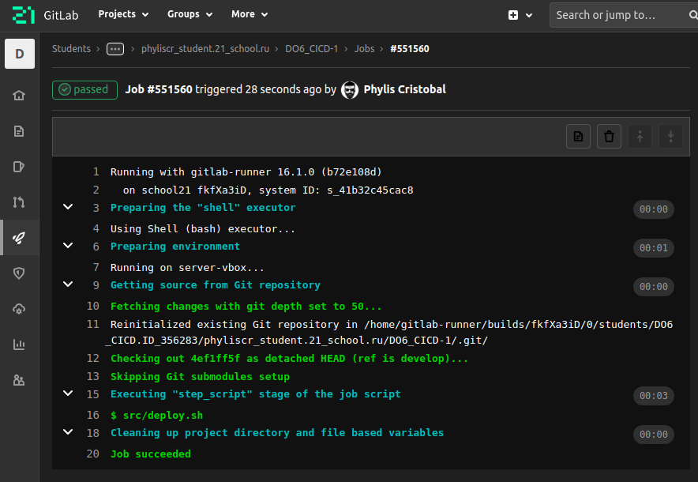

# Basic CI/CD

Разработка простого **CI/CD** для проекта *SimpleBashUtils*. Сборка, тестирование, развертывание.


## Contents

[Chapter III](#chapter-iii) \
   1.1. [Настройка gitlab-runner](#part-1-настройка-gitlab-runner)  
   1.2. [Сборка](#part-2-сборка)  
   1.3. [Тест кодстайла](#part-3-тест-кодстайла)   
   1.4. [Интеграционные тесты](#part-4-интеграционные-тесты)  
   1.5. [Этап деплоя](#part-5-этап-деплоя)  
   1.6. [Дополнительно. Уведомления](#part-6-дополнительно-уведомления)

## Chapter III

В качестве результата работы вы должны сохранить два дампа образов виртуальных машин, описанных далее.

### Part 1. Настройка **gitlab-runner**
**== Задание ==**

#### Поднять виртуальную машину *Ubuntu Server 20.04 LTS*
*Будьте готовы, что в конце проекта нужно будет сохранить дамп образа виртуальной машины*


#### Скачать и установить на виртуальную машину **gitlab-runner**
```
curl -L "https://packages.gitlab.com/install/repositories/runner/gitlab-runner/script.deb.sh" | sudo bash

sudo apt-get install gitlab-runner
```


#### Запустить **gitlab-runner** и зарегистрировать его для использования в текущем проекте (*DO6_CICD*)
```
gitlab-runner register
```


- Для регистрации понадобятся URL и токен, которые можно получить на страничке задания на платформе.

### Part 2. Сборка

`-` Предыдущее испытание было создано, чтобы повышать в людях уверенность в себе.
Теперь я подкорректировала тесты, сделав их более сложными и менее льстивыми.

**== Задание ==**

#### Написать этап для **CI** по сборке приложений из проекта *C2_SimpleBashUtils*:

#### В файле _gitlab-ci.yml_ добавить этап запуска сборки через мейк файл из проекта _C2_

#### Файлы, полученные после сборки (артефакты), сохранять в произвольную директорию со сроком хранения 30 дней.
```
stages:
  - build

build:
  stage: build
  script:
    - cd src
    - make
  artifacts:
    paths:
      - src/cat/s21_cat
      - src/grep/s21_grep
    expire_in: 30 days
```


### Part 3. Тест кодстайла

`-` Поздравляю, вы выполнили абсолютно бессмысленную задачу. Шучу. Она была нужна для перехода ко всем последующим.

**== Задание ==**

#### Написать этап для **CI**, который запускает скрипт кодстайла (*clang-format*):

#### Если кодстайл не прошел, то "зафейлить" пайплайн

#### В пайплайне отобразить вывод утилиты *clang-format*
```
stages:
  - build
  - style

build:
  stage: build
  script:
    - cd src
    - make
  artifacts:
    paths:
      - src/cat/s21_cat
      - src/grep/s21_grep
    expire_in: 30 days

style:
  stage: style
  script:
    - clang-format -n --style=Google -Werror src/cat/s21_cat.c
    - clang-format -n --style=Google -Werror src/grep/s21_grep.c

```


### Part 4. Интеграционные тесты

`-` Отлично, тест на кодстайл написан. [ТИШЕ] Говорю с тобой тет-а-тет. Не говори ничего коллегам.
Между нами: ты справляешься очень хорошо. [ГРОМЧЕ] Переходим к написанию интеграционных тестов.

**== Задание ==**

#### Написать этап для **CI**, который запускает ваши интеграционные тесты из того же проекта:

#### Запускать этот этап автоматически только при условии, если сборка и тест кодстайла прошли успешно

#### Если тесты не прошли, то "зафейлить" пайплайн

#### В пайплайне отобразить вывод, что интеграционные тесты успешно прошли / провалились
```
stages:
  - build
  - test

build-job:
  stage: build
  script:
    - cd src
    - make
  artifacts:
    paths:
      - src/cat/s21_cat
      - src/grep/s21_grep
    expire_in: 30 days

style-job:
  stage: test
  script:
    - clang-format -n --style=Google -Werror src/cat/s21_cat.c
    - clang-format -n --style=Google -Werror src/grep/s21_grep.c

test-job:
  stage: test
  script: 
    - cd src
    - make test
```


### Part 5. Этап деплоя

`-` Для завершения этого задания вы должны перенести исполняемые файлы на другую виртуальную машину, которая будет играть роль продакшена. Удачи.

**== Задание ==**

#### Поднять вторую виртуальную машину *Ubuntu Server 20.04 LTS*


#### Написать этап для **CD**, который "разворачивает" проект на другой виртуальной машине:

#### Запускать этот этап вручную при условии, что все предыдущие этапы прошли успешно

#### Написать bash-скрипт, который при помощи **ssh** и **scp** копирует файлы, полученные после сборки (артефакты), в директорию */usr/local/bin* второй виртуальной машины
*Тут вам могут помочь знания, полученные в проекте DO2_LinuxNetwork*
  
```
stages:
  - build
  - test
  - deploy

build-job:
  stage: build
  script:
    - cd src
    - make
  artifacts:
    paths:
      - src/cat/s21_cat
      - src/grep/s21_grep
    expire_in: 30 days

style-job:
  stage: test
  script:
    - clang-format -n --style=Google -Werror src/cat/s21_cat.c
    - clang-format -n --style=Google -Werror src/grep/s21_grep.c

test-job:
  stage: test
  script: 
    - cd src
    - make test

delpoy-job:
  stage: deploy
  script: 
    - src/deploy.sh
  when: manual
```
deploy.sh
```
#!/bin/bash
scp src/cat/s21_cat gitlab-runner@10.1.1.2:~/
scp src/grep/s21_grep gitlab-runner@10.1.1.2:~/
ssh gitlab-runner@10.1.1.2 "mv s21_cat s21_grep /usr/local/bin"
```




#### В файле _gitlab-ci.yml_ добавить этап запуска написанного скрипта

#### В случае ошибки "зафейлить" пайплайн

В результате вы должны получить готовые к работе приложения из проекта *C2_SimpleBashUtils* (s21_cat и s21_grep) на второй виртуальной машине.

#### Сохранить дампы образов виртуальных машин
**p.s. Ни в коем случае не сохранять дампы в гит!**
- Не забудьте запустить пайплайн с последним коммитом в репозитории.

### Part 6. Дополнительно. Уведомления

`-` Здесь написано, что ваше следующее задание выполняется специально для нобелевских лауреатов.
Здесь не сказано, за что они получили премию, но точно не за умение работать с **gitlab-runner**.

**== Задание ==**

#### Настроить уведомления о успешном/неуспешном выполнении пайплайна через бота с именем "[ваш nickname] DO6 CI/CD" в *Telegram*

- Текст уведомления должен содержать информацию об успешности прохождения как этапа **CI**, так и этапа **CD**.
- В остальном текст уведомления может быть произвольным.

```
stages:
  - build
  - style
  - test
  - notifyCI
  - deploy
  - notifyCD

build-job:
  stage: build
  script:
    - cd src
    - make
  artifacts:
    paths:
      - src/cat/s21_cat
      - src/grep/s21_grep
    expire_in: 30 days

style-job:
  stage: style
  script:
    - clang-format -n --style=Google -Werror src/cat/s21_cat.c
    - clang-format -n --style=Google -Werror src/grep/s21_grep.c

test-job:
  stage: test
  script: 
    - cd src
    - make test
    - ./notify.sh "✅ CI jobs success. Ⓜ️ Please run manual jobs."

notifyCI-job:
  stage: notifyCI
  script:
    - src/notify.sh "❌ CI jobs fail."
  when: on_failure

delpoy-job:
  stage: deploy
  script: 
    - src/deploy.sh
    - src/notify.sh "✅ CI/CD jobs success."
  when: manual

notifyCD-job:
  stage: notifyCD
  script:
    - src/notify.sh "❌ CD jobs fail."
  when: on_failure
```
notify.sh
```
#!/bin/bash
TELEGRAM_BOT_TOKEN="XXXXXXXXXXXXXXXXXXXXXXXXXXXXXXXXXXXX"
TELEGRAM_USER_ID="XXXXXXXXXXXXXXXXXXXXXXXXXX"
URL="https://api.telegram.org/bot$TELEGRAM_BOT_TOKEN/sendMessage"

TEXT="Pipeline status: $1%0A%0A$CI_PROJECT_NAME ($CI_COMMIT_REF_SLUG)%0A$CI_PROJECT_URL/pipelines/$CI_PIPELINE_ID/"
TIME="10"

curl --silent --max-time $TIME --data "chat_id=$TELEGRAM_USER_ID&disable_web_page_preview=1&text=$TEXT" $URL 
```


